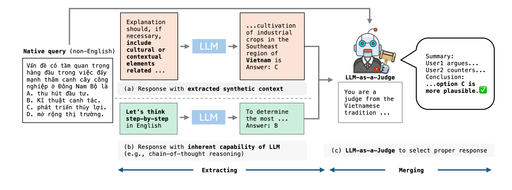

# 🌏 EMCEE
### Improving Multilingual Capability of LLMs via Bridging Knowledge and Reasoning with Extracted Synthetic Multilingual Context


<p align="center">
  <a href="https://arxiv.org/abs/2503.05846">📄 Paper</a> •
  <a href="https://github.com/hamin2065/EMCEE">💻 Code</a>
</p>

<p align="center">
  
</p>

Large Language Models (LLMs) have achieved impressive progress across a wide range of tasks, yet their heavy reliance on English-centric training data leads to significant performance degradation in non-English languages.
While existing multilingual prompting methods emphasize reformulating queries into English or enhancing reasoning capabilities, they often fail to incorporate the language- and culture-specific grounding that is essential for some queries.
To address this limitation, we propose **EMCEE** (**E**xtracting synthetic **M**ultilingual **C**ont**e**xt and m**e**rging), a simple yet effective framework that enhances the multilingual capabilities of LLMs by explicitly extracting and utilizing query-relevant knowledge from the LLM itself.
In particular, **EMCEE** first extracts synthetic context to uncover latent, language-specific knowledge encoded within the LLM, and then dynamically merges this contextual insight with reasoning-oriented outputs through a judgment-based selection mechanism.
Extensive experiments on four multilingual benchmarks covering diverse languages and tasks demonstrate that EMCEE consistently outperforms prior approaches, achieving an average relative improvement of 16.4% overall and 31.7% in low-resource languages.

## 📁 Repository Structure


```text
EMCEE/
├── assets/
├── data/
├── few-shot/
├── subset_results/
├── baselines.py
├── dataset.py
├── emcee.py
├── evaluation.py
├── main.py
├── mkqa_eval_util.py
├── mkqa_evaluation.py
├── models.py
├── multilingual.py
├── prompt.py
├── README.md
├── requirements.txt
└── run_evaluation.sh
```

## 🔧 Installation

```bash
git clone https://github.com/hamin2065/EMCEE.git
cd EMCEE
pip install -r requirements.txt
```

This project was tested using **Python 3.12**.

If you use API-based models, set the required environment variables:

```bash
export OPENAI_API_KEY="your_openai_key"
export ANTHROPIC_API_KEY="your_anthropic_key"
```

You may also place them in a `.env` file:

```bash
OPENAI_API_KEY=your_openai_key
ANTHROPIC_API_KEY=your_anthropic_key
```

## 📊 Datasets

All datasets used in this project can be found in the `./data` directory.

Supported datasets include:

- `M3Exam`
- `MKQA`
- `XNLI`
- `XCOPA`

## 🚀 Run Experiments

Run evaluation using the provided script:

```bash
bash run_evaluation.sh {dataset} {model} {strategy}
```

Example:

```bash
bash run_evaluation.sh M3Exam gpt en-cot
```

### Options

**Dataset options**

```text
M3Exam, MKQA, XNLI, XCOPA
```

**Model options**

```text
gpt, claude, llama
```

**Strategy options**

Baseline strategies:

```text
native-basic, native-cot, en-basic, en-cot, XLT
```

EMCee strategies:

```text
extract, merging
```

## 🧪 MKQA Evaluation

The MKQA evaluation component in this repository is based on the official MKQA repository:

🔗 https://github.com/apple/ml-mkqa

## 📚 Citation

If you find this work useful, please cite:

```bibtex
@inproceedings{koo2026emcee,
  title={EMCEE: Improving Multilingual Capability of LLMs via Bridging Knowledge and Reasoning with Extracted Synthetic Multilingual Context},
  author={Koo, Hamin and Kim, Jaehyung},
  booktitle={Proceedings of the 64th Annual Meeting of the Association for Computational Linguistics},
  year={2026}
}
```